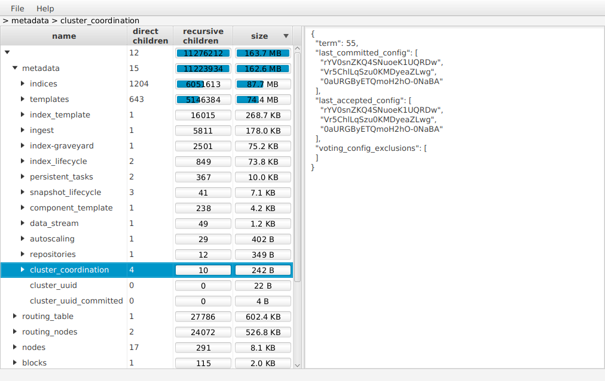

# json-viewer

Simple application to visualize (list keys and preview nodes) big json files.
It requires java 17 with preview features enabled.

* Run application: `./gradlew run` or `./gradlew run --args='${pathToJsonFile}'`
* Create distribution (with bundled jre): `./gradlew jlink` (available in `./build/image`)
* Start distribution (from `./build/image`) `./bin/json-viewer` or `./bin/json-viewer ${pathToJsonFile}`
